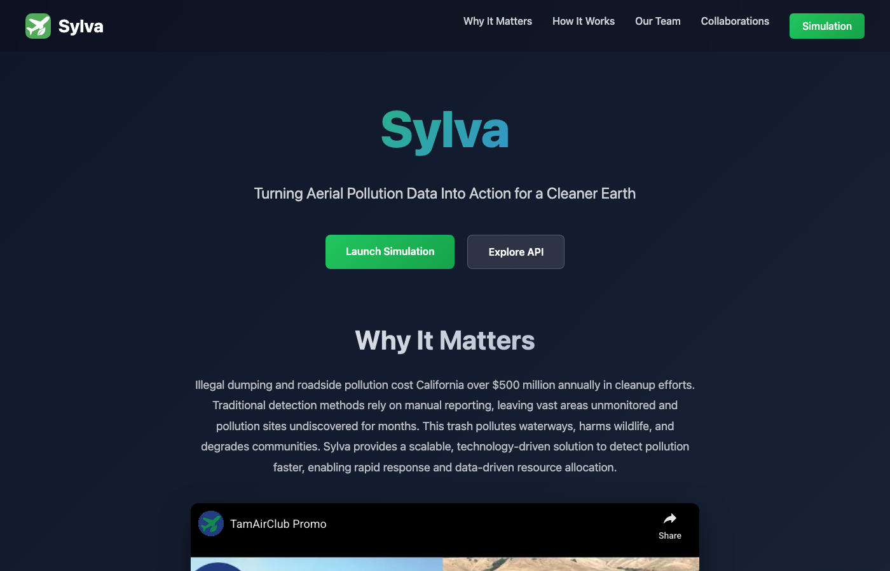
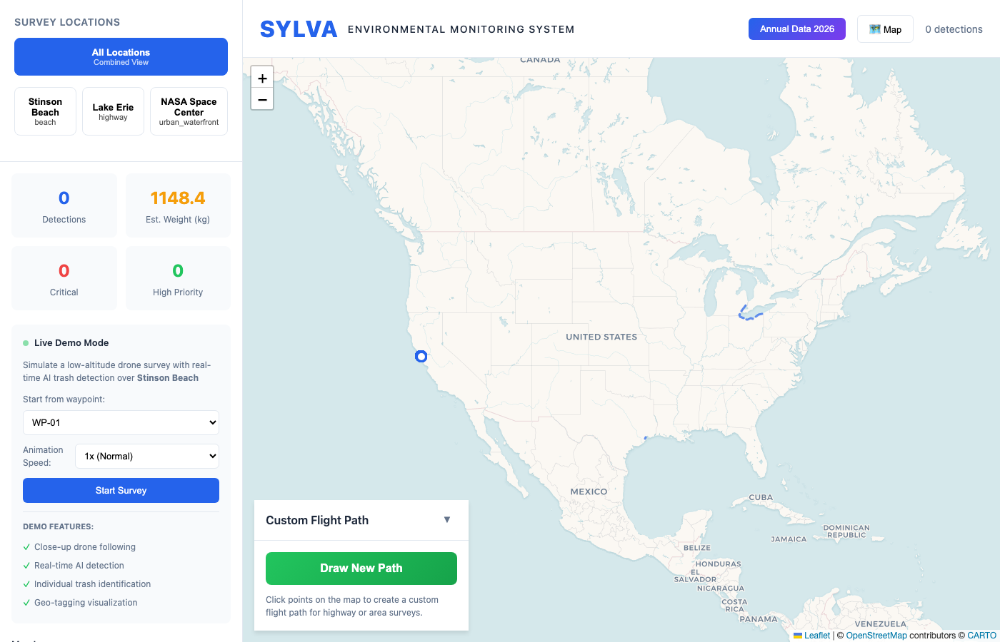

# SYLVA - Environmental Monitoring Drone Simulation

**TamAir Team - Conrad Challenge 2026**

Sylva is a system of autonomous fixed-wing drones designed to detect and map environmental pollution across highways, coastlines, and natural habitats. This repository contains a **realistic simulation** demonstrating the Sylva system's capabilities.

---

## Live Demo

**Experience the Sylva Dashboard:**

| Resource | URL |
|----------|-----|
| **Dashboard** | [https://sylva-dashboard.onrender.com](https://sylva-dashboard.onrender.com) |
| **API** | [https://sylva-api.onrender.com](https://sylva-api.onrender.com) |
| **API Docs** | [https://sylva-api.onrender.com/docs](https://sylva-api.onrender.com/docs) |

> **Note**: The dashboard is hosted on Render's free tier. Initial load may take 30-60 seconds if the service has been idle.

---

## Screenshots

### Landing Page

*The Sylva homepage featuring the mission statement, promo video, and navigation to the simulation.*

### Simulation Dashboard

*The interactive simulation dashboard showing all three survey locations across the United States with flight paths, detection controls, and live demo features.*

---

## Overview

The Sylva simulation demonstrates:
- **Autonomous drone flight path generation** over real geographic locations
- **AI-powered trash detection** and classification with 8 waste categories
- **Geo-tagged waste mapping** with precise GPS coordinates
- **Density analysis** for identifying pollution hotspots
- **Real-time live demo** with smooth drone animation and progressive detection
- **Interactive dashboard** for agency coordination and cleanup planning

---

## Survey Locations

The simulation covers three diverse environmental monitoring sites across the United States:

| Location | Environment | Path Length | Detections |
|----------|-------------|-------------|------------|
| **Stinson Beach, California** | Coastal/Beach | ~13 km | ~95 |
| **Lake Erie, Ohio** | Highway & Waterfront | ~430 km | ~95 |
| **NASA Space Center, Texas** | Urban Waterfront | ~23 km | ~110 |

### Location Details

1. **Stinson Beach Coastline, California**
   - Beach and coastal environment monitoring
   - High plastic bottle and organic waste detection
   - Critical areas near sensitive marine ecosystems

2. **Lake Erie - Highway & Waterfront, Ohio**
   - Extended highway corridor survey (I-90, Route 2)
   - Spans from Cleveland to Buffalo along Lake Erie
   - High metal debris and tire detection from road traffic

3. **NASA Space Center Houston, Texas**
   - Urban waterfront environment near Clear Lake
   - Survey around Johnson Space Center perimeter
   - Mix of urban waste and waterway pollution monitoring

---

## Dashboard Features

### Interactive Map
- **Multiple base layers**: Standard, Satellite, and Terrain views
- **Flight path visualization**: See complete drone survey routes with waypoints
- **Detection markers**: Color-coded by waste category, sized by priority
- **Heatmap overlay**: Toggle density visualization to identify pollution hotspots
- **Zoom & Pan**: Full map control during live demos

### Live Demo Mode
- **Smooth drone animation**: Watch the Sylva drone fly its survey route in real-time
- **Progressive detection**: See trash detections appear as the drone scans each area
- **Computer Vision AI panel**: View simulated AI analysis with confidence scores
- **Speed control**: Adjust animation speed (1x to 10x)
- **Re-center button**: Return focus to drone if you pan away

### Detection Visualization
| Priority | Circle Size | Border Color | Description |
|----------|-------------|--------------|-------------|
| **Critical** | 12px | Dark Red | Large debris, near sensitive ecosystems |
| **High** | 10px | Orange | Significant accumulation, moderate risk |
| **Medium** | 6px | White | Standard detection, routine cleanup |
| **Low** | 4px | White | Minor debris, low environmental impact |

### Filtering & Statistics
- Filter by waste category (8 types)
- Filter by priority level (4 levels)
- View total detections, estimated weight (kg), and area coverage
- Category breakdown charts

### Custom Path Drawing
- Draw custom survey paths directly on the map
- Generate simulated detections for any user-defined route
- Save and manage multiple custom paths

---

## Waste Categories Detected

| Category | Color | Description |
|----------|-------|-------------|
| **Plastic Bottles** | Blue (#3498db) | Water bottles, beverage containers |
| **Food Packaging** | Orange (#e67e22) | Wrappers, containers, cardboard |
| **Tires** | Dark Gray (#2c3e50) | Vehicle tires, tire fragments |
| **Metal Debris** | Gray (#95a5a6) | Cans, automotive parts, scrap metal |
| **Construction Waste** | Purple (#8e44ad) | Concrete, lumber, building materials |
| **Organic Waste** | Green (#27ae60) | Food waste, vegetation debris |
| **Glass** | Teal (#1abc9c) | Bottles, broken glass |
| **Textile/Fabric** | Red (#e74c3c) | Clothing, fabric scraps |

---

## API Reference

### Base URL
```
https://sylva-api.onrender.com/api
```

### Endpoints

| Endpoint | Method | Description |
|----------|--------|-------------|
| `/locations` | GET | List all survey locations with metadata |
| `/flights/{location_id}` | GET | Get flight path GeoJSON for a location |
| `/detections` | GET | Get detections with optional filters |
| `/detections/categories` | GET | List all waste categories |
| `/stats` | GET | Summary statistics (counts, weights) |
| `/stats/{location_id}` | GET | Location-specific statistics |
| `/heatmap` | GET | Heatmap data points for density visualization |
| `/clusters` | GET | High-density pollution clusters |

### WebSocket Endpoints

| Endpoint | Description |
|----------|-------------|
| `wss://sylva-api.onrender.com/ws/demo/{location_id}` | Live demo animation stream |
| `wss://sylva-api.onrender.com/ws/custom-demo` | Custom path demo stream |

### Query Parameters for `/detections`

| Parameter | Type | Description |
|-----------|------|-------------|
| `location` | string | Filter by location ID |
| `category` | string | Filter by waste category |
| `priority` | string | Filter by priority level |
| `min_confidence` | float | Minimum confidence threshold (0-1) |
| `limit` | int | Maximum results to return |

### Example API Calls

```bash
# Get all locations
curl https://sylva-api.onrender.com/api/locations

# Get detections for Stinson Beach
curl https://sylva-api.onrender.com/api/detections?location=stinson_beach

# Get high-priority detections only
curl https://sylva-api.onrender.com/api/detections?priority=critical

# Get statistics
curl https://sylva-api.onrender.com/api/stats
```

---

## Technical Specifications

### Sylva-1 Drone Specifications

| Specification | Value |
|---------------|-------|
| Type | Fixed-wing UAV |
| Wingspan | 2.5 meters |
| Survey Altitude | 120-150m AGL |
| Survey Speed | 15-20 m/s |
| Camera | 20MP RGB + Multispectral |
| Flight Endurance | 2-3 hours |
| Coverage Rate | ~50 hectares/hour |

### Detection Algorithm

- **Model**: Simulated YOLO-based object detection
- **Confidence Range**: 75-99%
- **Detection Distribution**: Poisson-based probability model
- **Environment Adaptation**: Detection rates vary by terrain type
- **Size Estimation**: Based on object category and confidence
- **Weight Estimation**: Derived from size and material density

### Heatmap Visualization

The heatmap uses a gradient from green (low density) to deep red (critical density):

```
Green → Yellow-Green → Yellow → Amber → Orange → Red → Deep Red
(low)                                                    (critical)
```

- **Radius**: 35 pixels
- **Minimum Opacity**: 40%
- **Intensity Scaling**: Based on detection priority and proximity

---

## Data Formats

All geographic data uses **GeoJSON** format (RFC 7946), compatible with:
- QGIS
- ArcGIS
- Mapbox
- Google Earth
- Any GIS software

### Detection GeoJSON Structure

```json
{
  "type": "Feature",
  "geometry": {
    "type": "Point",
    "coordinates": [-122.6445, 37.8991]
  },
  "properties": {
    "id": "DET-STI-001-A1B2C3",
    "category": "plastic_bottle",
    "category_name": "Plastic Bottles",
    "confidence": 0.92,
    "priority": "high",
    "estimated_weight_kg": 0.04,
    "size_m2": 0.003,
    "color": "#3498db",
    "timestamp": "2026-01-15T09:23:45"
  }
}
```

---

## Local Development

### Prerequisites

- Python 3.8+
- Node.js 18+
- npm

### Quick Start

```bash
# Clone the repository
git clone https://github.com/justinmerlin2009/sylva.git
cd sylva

# Run everything with a single command
./run.sh
```

This will:
1. Install Python dependencies
2. Install Node.js dependencies
3. Generate simulation data (if not already generated)
4. Start the API server (port 8000)
5. Start the dashboard (port 3000)

### Running Components Separately

**API Server:**
```bash
source venv/bin/activate
python -m uvicorn api.main:app --reload --port 8000
```

**Dashboard:**
```bash
cd dashboard
npm run dev
```

**Regenerate Simulation Data:**
```bash
source venv/bin/activate
python -m simulation.data_generator
```

### Local URLs

| Resource | URL |
|----------|-----|
| Dashboard | http://localhost:3000 |
| API | http://localhost:8000 |
| API Docs | http://localhost:8000/docs |

---

## Project Structure

```
sylva_conrad_simulation/
├── run.sh                  # Single command launcher
├── requirements.txt        # Python dependencies
├── README.md               # This file
│
├── simulation/             # Python simulation engine
│   ├── config.py           # Locations, drone specs, parameters
│   ├── flight_paths.py     # Flight path generation
│   ├── trash_detector.py   # Trash detection simulation
│   └── data_generator.py   # Main data generation script
│
├── api/                    # FastAPI backend
│   ├── main.py             # API endpoints + WebSocket
│   └── models.py           # Pydantic data models
│
├── data/                   # Generated simulation data
│   ├── flights/            # Flight path GeoJSON files
│   ├── detections/         # Detection GeoJSON files
│   ├── animations/         # Pre-computed animation frames
│   └── summary/            # Statistics and summaries
│
└── dashboard/              # React frontend
    ├── src/
    │   ├── App.jsx         # Main application
    │   ├── components/
    │   │   ├── Map.jsx         # Leaflet map with layers
    │   │   ├── Sidebar.jsx     # Filters and statistics
    │   │   ├── LiveDemo.jsx    # Animation controls
    │   │   ├── DetectionPanel.jsx  # AI detection display
    │   │   ├── PathDrawer.jsx  # Custom path drawing
    │   │   └── AnnualData.jsx  # Annual analytics
    │   └── styles.css      # Styling
    └── package.json
```

---

## Conrad Challenge 2026

This project was developed by **TamAir**, a team of four high school students, for the **Conrad Challenge 2026** organized in partnership with NASA.

### Mission Statement

> Optimize environmental cleanup operations by providing government agencies with accurate, actionable data on pollution locations, types, and severity—enabling faster response times, reduced cleanup costs, and measurable environmental impact.

### Target Users

- **Caltrans** (California Department of Transportation)
- **National Park Service**
- **EPA Regional Offices**
- **State Environmental Agencies**
- **Municipal Public Works Departments**
- **Cleanup Coordination Organizations**

### Key Value Propositions

1. **Automated Monitoring**: Reduce manual survey costs by 80%
2. **Precise Mapping**: GPS-accurate detection for efficient cleanup routing
3. **Priority Scoring**: Focus resources on critical areas first
4. **Trend Analysis**: Track pollution patterns over time
5. **Water Protection**: Identify debris near waterways before contamination

---

## Statistics Summary

Current simulation data includes:

| Metric | Value |
|--------|-------|
| Total Detections | 300 |
| Total Weight | 1,148 kg |
| Survey Locations | 3 |
| Flight Paths | 3 |
| Waste Categories | 8 |

---

## License

This project is for educational and competition purposes as part of the Conrad Challenge 2026.

---

## Contact

**TamAir Team**
- GitHub: [github.com/justinmerlin2009/sylva](https://github.com/justinmerlin2009/sylva)
- Conrad Challenge 2026 Entry

---

*Developed with environmental stewardship in mind.*
